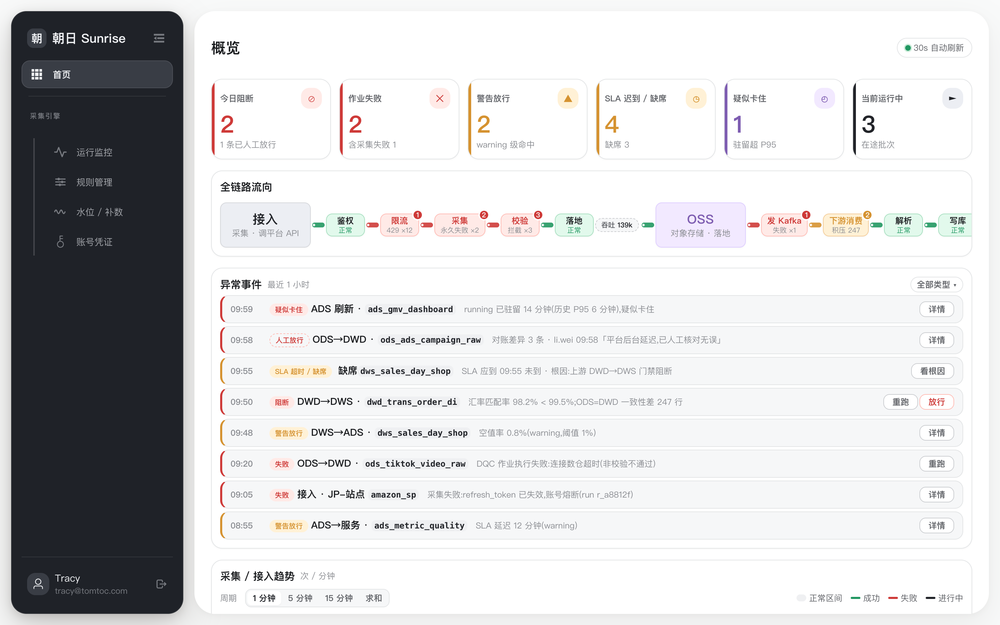
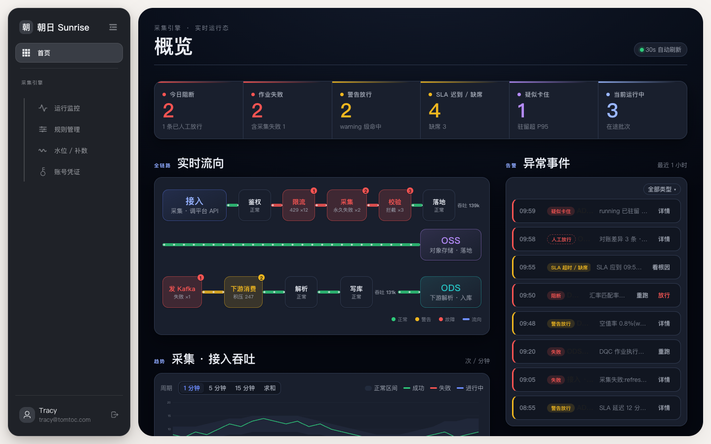
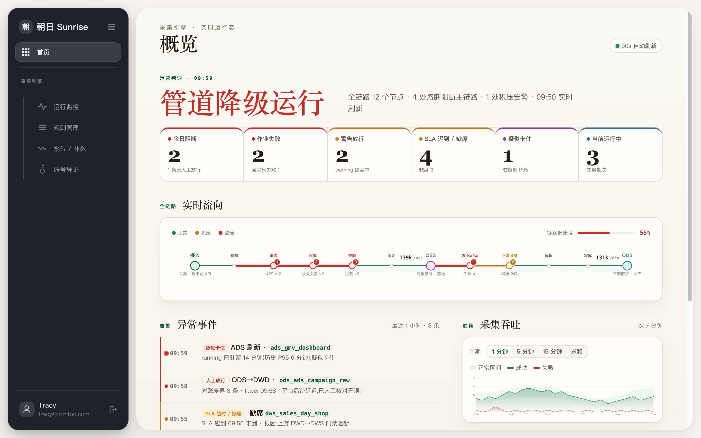
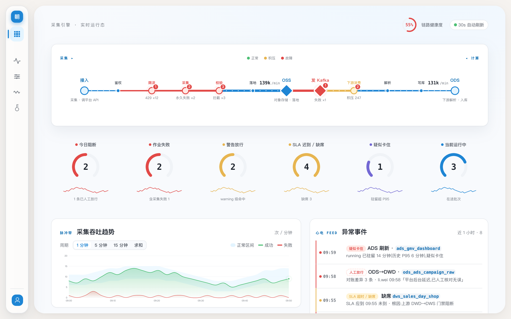
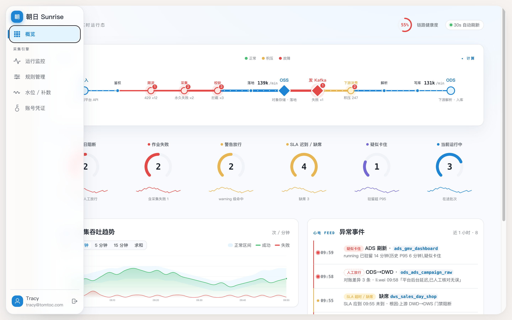

# Claude Code Skills

我的 [Claude Code](https://claude.com/claude-code) 个人技能集。

## 安装

把某个 skill 文件夹复制进你的技能目录:

```bash
cp -r premium-design-loop ~/.claude/skills/
```

## 技能列表

| 技能 | 作用 |
|------|------|
| **premium-design-loop** | 把网页视觉质感做「高级」。**两档**:`Polish` 逐轮微调(渲染→12 维打分→优化最弱维度→重打分);`Redesign` 大改(发散多个全异方向→你选一个→整体重建,**布局/配色/视觉元素三轴同改**)。覆盖排版、层级、配色、光影动效、移动端、可访问性、收尾。 |

## 使用方法

`premium-design-loop` 为例:

```text
/premium-design-loop <本地路径 或 URL>
# 例:/premium-design-loop ./web        把本地项目某页做得更高级
#     /premium-design-loop https://你的站.com/
```

调用后它会:

1. **配置**——问几个关键项:平台范围(PC / 移动 / 双端)、**参照品牌**(Apple / Linear / Stripe…,让打分有锚)、光影强度、运行模式(`Auto` 跑完出报告 / `Step` 每轮暂停确认)。
2. **逐轮迭代**——截图 → 派评审 subagent 按 12 维打分并指出最弱项 → 优化 → 重新截图对比 → 再打分。
3. **产出**——每轮 `before / after` 对比截图(存 `.design-shots/`)、改动清单、分数演进,以及还差什么的建议。源码每轮自动 checkpoint(可回滚)。

## 注意事项

- **需要能渲染页面**:接 `chrome-devtools` MCP 或 Claude in Chrome 最佳;否则只能从源码「估」,颜色/动效/移动端的分都不准。
- **光影 / 动效靠静态截图判不了**:这类要开本地预览**实时看**或录 GIF,按「快一点 / 少一点 / 去掉」逐次微调——不要凭截图就签收。
- **大型在用组件**(几千行的工具页):默认安全层先行,**不碰业务逻辑**,重排 / 删内容 / 改导航这类结构性改动会**先停下问你**(多是产品决策)。
- **12 维分数是「循环驱动器」,不是精确指标**——它会因锚定而虚高。真正看的是**前后对比图 + 你自己的眼睛**。
- **会改你的源码文件**:确保在 git 仓库或有备份(skill 每轮自动 checkpoint 到 `.design-backups/`)。改完只在本地,**不会自动部署**。

## 实战演示:guobi.ai 首页

用 `premium-design-loop` 把果比AI 首页从默认「AI 味」页面迭代到「暖版 Apple + 光影」。每张是该轮**优化后**的状态:

**原始** — 默认系统字、扁平等权卡片、大片死空白、新闻味文案。


**第 1 轮 · 排版与层级** — 衬线大标题、卡片序号分级、暖色光晕背景、文案去模板化。


**第 2 轮 · 图标系统 + 主张** — 统一线性图标系统、「结论 · 判断 · 风险信号」价值条、修复对比度。


**第 3 轮 · 主推卡** — 日报做成主推卡(暖金渐变 + 反白图标 + 「今日」标签)。


**第 4 轮 · 跨栏 Hero** — 日报升级为跨栏全宽 hero、副标题改衬线,建立三级字阶。


**最终 · 暖版 Apple + 光影** — 超大衬线标题、漂浮暖光球、颗粒质感、漂移蓝图网格、mono 技术标签、光标视差,定位重塑为「AI 试验场」。


## 实战演示二:内页一致性(/shares 列表页)

高级感是**整站属性**——漂亮首页配通用内页反而更廉价。首页磨好后,用**同一个 skill**、复用首页那套光影系统,把 `/shares` 列表页也拉齐。

**之前** — 导航栏下挂了个通用博客列表:扁平等权、无光影、信息密度低。


**之后** — 接入首页同款光影外壳 + 衬线大标题 + 「原创 · 长期实践」署名条 + 紧凑横排列表(桌面小缩略图行、移动端封面顶置,封面 16:9 完整不裁)。**复用已建立的设计系统**,而不是另起一套——这正是单页 skill 看不见、却最影响整站质感的一环。


---

## 复盘 · v2:从「只会微调」到「能大改」(2026-06)

用这个 skill 反复打磨一个**数据采集控制台**的 dashboard 时,暴露出它**结构性地保守**,以及随后的改造。

### 发现的问题

- **只调局部 craft**:配色/间距/层级越磨越细,但布局、组件画法、整体概念从不变——「同一套家具换个房间摆法」。
- **把组件/配色当成不可动**:KPI 永远是卡片、流向永远是方块+连线、配色默认沿用——「重做」也只是挪积木 + 换色。
- **审美被写死**:即便加了「重做」机制,提炼出的「杠杆」(主角/genre/降级/一个 accent)又变成新模板,每次收敛到同一种风格。
- **该问的没问**:吃会话存量配置,把「参考图 / 光影 / 动画」这些选项默默默认掉。
- 每一次大跨越都是**被用户逼出来的**,skill 自己从不主动提。

**根因**:评分 loop 是个**收敛的爬山算法**,只优化当前设计的弱维度,从没有「跳出当前山头」的步骤;再加上一堆把「习惯」当「硬约束」的措辞(保留组件 / 保留配色 / 安全层先行),天花板被锁死。

### 做的改造(skill v2)

- **新增 `Redesign` 跳跃档 + Re-envision 相位**:先并行发散 2–3 个**全异**方向(布局/IA + 配色 + 视觉元素三轴同改)→ 用户选 → 整体重建 → 再交收敛 loop 打磨。
- **取消限制**:发散前先做**约束审计**——只有「数据契约 + 用户点名的品牌本质 + a11y/质量门」是真不可变,其余(布局/配色/组件/密度/甚至「是不是个 dashboard」)一律可删。
- **固化方法而非审美**:所有具体招式(genre/hero/Sankey/量规/一个 accent/字体配对/光影 toolkit)降级为**「用过即弃的例子」**;要求**最大化方差、不复刻上次结果**。
- **移除「克制优先」核心法则**;解锁工艺/光影层(量规不再奖励「克制/微妙」,刻意静态也能拿满分)。
- **新增「跟随参考图/网址」配置项**(给图就照着改)。
- **两道强制闸**:每次必跑**配置提问闸**(野心/平台/参考图/光影动画,不许靠存量跳过)+ 每次改前**备份闸**。
- 全程用**独立审计 subagent** 复验「是否完全解锁」,逐条堵掉残留的设计锁。

### 迭代画廊:数据控制台整屏重设计

同一份数据(KPI / 全链路流向 / 异常事件 / 趋势),`Redesign` 档发散出的**截然不同**的整屏方案——这是「解锁后」才到得了的跨度。四个方案**数据/路由/逻辑一行没动**,只换「长相」。

**① 原始** — 暖灰模板感:等权卡片、方块+连线的流向、信息平铺。典型「能用但不值钱」。



**② 深色作战室(发散方向之一,被否决)** — 深靛岩聚光 + 霓虹遥测 + 双栏。一次真正的跨越,但用户嫌深色——`Redesign` 的价值正在于**先发散多个再让你选**。



**③ 运营简报(亮色)** — serif 巨号「判词」头条(由数据派生)+ 状态条 + 细线管线脊 + 非对称双栏。暖纸 + 常青绿,编辑式 POV。



**④ 脉搏画布(最终 · 含左侧导航重设计)** — 全链路做成全宽「数据脉搏」主角(异常节点搏动)、6 KPI = 环绕的「读数卫星」(gauge 环 + sparkline)、心电 feed、健康环;azure 瓷白、零分割线。**连侧栏一起换**:深色长条 → 浅色悬浮玻璃图标 rail。



**侧栏展开态** — hover / 聚焦浮出玻璃面板,主区不位移。



> v2 要达到的不是「把同一个设计磨得更亮」,而是**长出更多、更好、不一样**的设计:布局、配色、画法、连导航全可换,唯一不动的是数据与逻辑。
