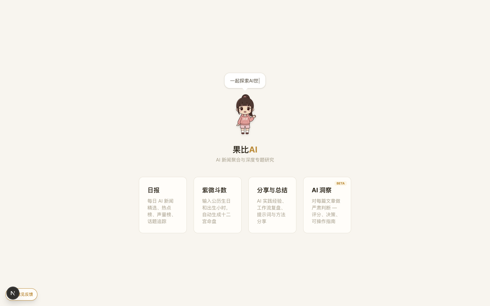
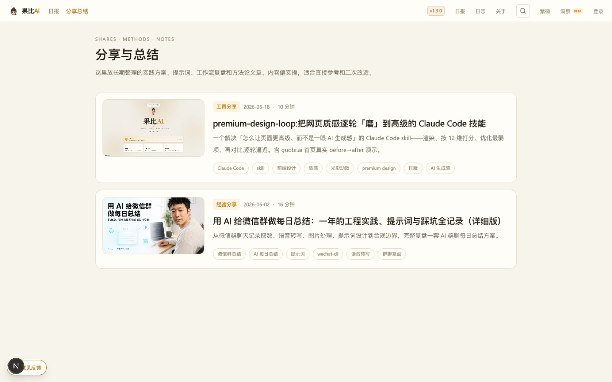
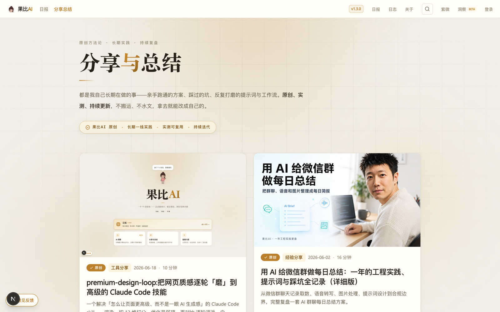

# Claude Code Skills

我的 [Claude Code](https://claude.com/claude-code) 个人技能集。

## 安装

把某个 skill 文件夹复制进你的技能目录:

```bash
cp -r premium-design-loop ~/.claude/skills/
```

## 技能列表

| 技能 | 作用 |
|------|------|
| **premium-design-loop** | 把网页视觉质感逐轮迭代到「高级」。每轮:渲染 → 12 维打分 → 优化最弱维度 → 重新打分,带前后对比截图。覆盖排版、层级、配色、光影动效、移动端、可访问性、收尾细节。 |

## 使用方法

`premium-design-loop` 为例:

```text
/premium-design-loop <本地路径 或 URL>
# 例:/premium-design-loop ./web        把本地项目某页做得更高级
#     /premium-design-loop https://你的站.com/
```

调用后它会:

1. **配置**——问几个关键项:平台范围(PC / 移动 / 双端)、**参照品牌**(Apple / Linear / Stripe…,让打分有锚)、光影强度、运行模式(`Auto` 跑完出报告 / `Step` 每轮暂停确认)。
2. **逐轮迭代**——截图 → 派评审 subagent 按 12 维打分并指出最弱项 → 优化 → 重新截图对比 → 再打分。
3. **产出**——每轮 `before / after` 对比截图(存 `.design-shots/`)、改动清单、分数演进,以及还差什么的建议。源码每轮自动 checkpoint(可回滚)。

## 注意事项

- **需要能渲染页面**:接 `chrome-devtools` MCP 或 Claude in Chrome 最佳;否则只能从源码「估」,颜色/动效/移动端的分都不准。
- **光影 / 动效靠静态截图判不了**:这类要开本地预览**实时看**或录 GIF,按「快一点 / 少一点 / 去掉」逐次微调——不要凭截图就签收。
- **大型在用组件**(几千行的工具页):默认安全层先行,**不碰业务逻辑**,重排 / 删内容 / 改导航这类结构性改动会**先停下问你**(多是产品决策)。
- **12 维分数是「循环驱动器」,不是精确指标**——它会因锚定而虚高。真正看的是**前后对比图 + 你自己的眼睛**。
- **会改你的源码文件**:确保在 git 仓库或有备份(skill 每轮自动 checkpoint 到 `.design-backups/`)。改完只在本地,**不会自动部署**。

## 实战演示:guobi.ai 首页

用 `premium-design-loop` 把果比AI 首页从默认「AI 味」页面迭代到「暖版 Apple + 光影」。每张是该轮**优化后**的状态:

**原始** — 默认系统字、扁平等权卡片、大片死空白、新闻味文案。



**第 1 轮 · 排版与层级** — 衬线大标题、卡片序号分级、暖色光晕背景、文案去模板化。


**第 2 轮 · 图标系统 + 主张** — 统一线性图标系统、「结论 · 判断 · 风险信号」价值条、修复对比度。


**第 3 轮 · 主推卡** — 日报做成主推卡(暖金渐变 + 反白图标 + 「今日」标签)。


**第 4 轮 · 跨栏 Hero** — 日报升级为跨栏全宽 hero、副标题改衬线,建立三级字阶。


**最终 · 暖版 Apple + 光影** — 超大衬线标题、漂浮暖光球、颗粒质感、漂移蓝图网格、mono 技术标签、光标视差,定位重塑为「AI 试验场」。


## 实战演示二:内页一致性(/shares 列表页)

高级感是**整站属性**——漂亮首页配通用内页反而更廉价。首页磨好后,用**同一个 skill**、复用首页那套光影系统,把 `/shares` 列表页也拉齐。

**之前** — 导航栏下挂了个通用博客列表:扁平等权、无光影、封面被窄列裁掉大半。



**之后** — 接入首页同款光影外壳 + 衬线大标题 + 「原创 · 长期实践」署名条 + 16:9 封面完整的编辑式两列卡片,移动端专门适配。**复用已建立的设计系统**,而不是另起一套——这正是单页 skill 看不见、却最影响整站质感的一环。


